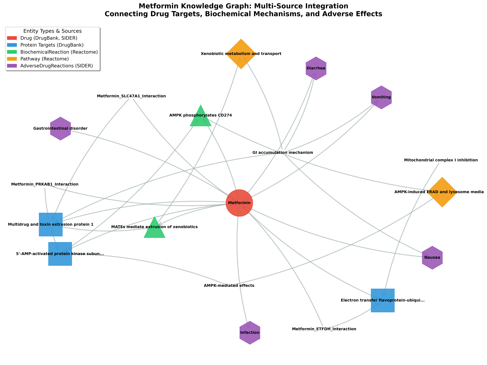
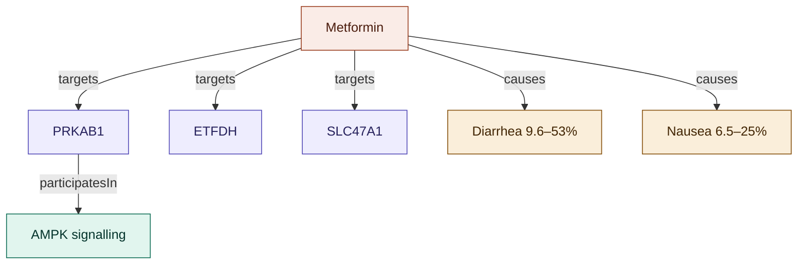
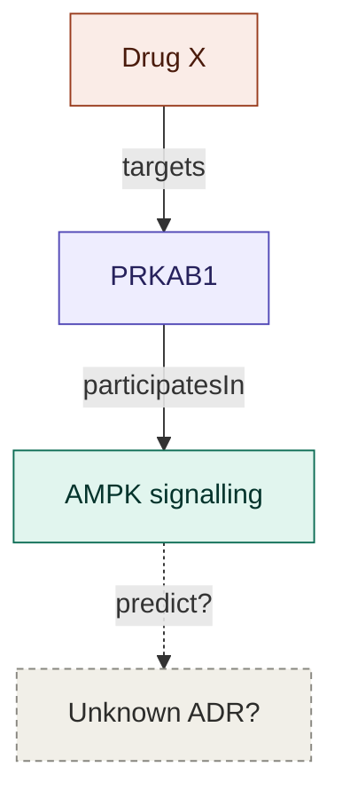

# Knowledge Graph for Drug Safety

**Integrating Multi-Source Biomedical Data for Adverse Drug Reaction Analysis**

**Conference**: Medical Informatics Europe (MIE) 2026  
**Authors**: Kalliopi Kastampolidou, Pantelis Natsiavas  
**Institution**: Institute of Applied Biosciences, Centre for Research & Technology Hellas, Greece

**Status**: Accepted at MIE 2026 - Poster presentation

---

## Abstract

This repository accompanies our MIE 2026 paper on knowledge graph construction for adverse drug reaction analysis. The pipeline integrates data from three sources - DrugBank (drug-target interactions), Reactome (biochemical pathways) and SIDER (adverse effects) - into RDF/OWL knowledge graphs following defined extraction rules. As a proof-of-concept, we applied it to metformin, yielding 139 RDF triples that link molecular targets to clinical adverse effects across all three sources.

---

## Repository Contents

### Scripts
- `create_metformin_kg.py` - Knowledge graph construction implementation
- `visualize_kg.py` - Graph visualization generator
- `query_examples.py` - SPARQL query demonstrations (7 queries)

### Output
- `metformin_kg.owl` - RDF/XML serialization
- `metformin_kg.ttl` - Turtle serialization (human-readable)
- `metformin_kg.nt` - N-Triples serialization
- `figures/` - Network visualizations

---

## Methodology

### Pipeline Design

The pipeline applies four extraction steps to any target drug. First, all protein targets are retrieved from DrugBank using the drug's DrugBank identifier (gene symbol, UniProt ID, action type). Second, biochemical reactions are extracted from Reactome via the drug's ChEBI identifier, capturing reaction IDs and pathway associations. Third, the top five adverse reactions by incidence frequency are retrieved from SIDER using the PubChem identifier, including placebo-controlled rates where available. Finally, a cross-database identifier table is maintained to link DrugBank, ChEBI, PubChem, and ATC codes throughout.
For this proof-of-concept, all steps were executed manually via database web interfaces. Automation is planned as future work.

---

## Results

### Quantitative Metrics

| Metric | Value |
|--------|-------|
| Total RDF triples | 139 |
| Graph nodes | 19 |
| Graph edges | 28 |
| Protein targets | 3 (ETFDH, PRKAB1, SLC47A1) |
| Biochemical reactions | 2 (R-HSA-9931292, R-HSA-434650) |
| Pathways | 2 (AMPK signaling, Xenobiotic transport) |
| Adverse drug reactions | 5 (with quantified frequencies) |
| Data sources integrated | 3 (DrugBank, Reactome, SIDER) |

### Knowledge Graph Schema

**Entity Types**
- Drug (1 instance)
- Protein (3 instances)
- BiochemicalReaction (2 instances)
- Pathway (2 instances)
- AdverseDrugReaction (5 instances)

**Relationship Types**
- `targets`: Drug to Protein
- `participatesIn`: Drug/Protein to BiochemicalReaction
- `partOf`: BiochemicalReaction to Pathway
- `causes`: Drug to AdverseDrugReaction
- `catalyzes`: Protein to BiochemicalReaction
- `linkedTo`: Mechanistic hypothesis connections

All triples include provenance metadata (`dcterms:source`) indicating origin database.

---

## Execution Instructions

### Requirements

Python 3.10 or higher with the following packages:
```
rdflib>=6.0.0
networkx>=2.8.0
matplotlib>=3.8.0
numpy>=1.21.0
```

Install dependencies:
```bash
pip install -r requirements.txt
```

### Building the Knowledge Graph

```bash
python scripts/create_metformin_kg.py
```

This generates three output files:
- `output/metformin_kg.owl` (RDF/XML format)
- `output/metformin_kg.ttl` (Turtle format)
- `output/metformin_kg.nt` (N-Triples format)

### Generating Visualizations

```bash
python scripts/visualize_kg.py
```

Output: PNG files in `output/`

### Running SPARQL Queries

```bash
python scripts/queries.py
```

Executes seven demonstration queries showing:
1. Drug-target relationships
2. Adverse reaction frequencies
3. Biochemical reaction involvement
4. Integration chains (drug to pathway)
5. Data provenance analysis
6. Entity-specific information retrieval
7. Entity type statistics

---

## Example SPARQL Queries

### Query 1: Protein Targets

```sparql
PREFIX kg: <http://example.org/adr-kg/>
PREFIX rdfs: <http://www.w3.org/2000/01/rdf-schema#>

SELECT ?protein ?gene
WHERE {
  kg:Metformin kg:targets ?target .
  ?target rdfs:label ?protein .
  ?target kg:geneSymbol ?gene .
}
```

Results:
- Electron transfer flavoprotein-ubiquinone oxidoreductase (ETFDH)
- 5'-AMP-activated protein kinase subunit beta-1 (PRKAB1)
- Multidrug and toxin extrusion protein 1 (SLC47A1)

### Query 2: Adverse Reactions with Frequencies

```sparql
PREFIX kg: <http://example.org/adr-kg/>
PREFIX rdfs: <http://www.w3.org/2000/01/rdf-schema#>

SELECT ?adr ?frequency ?rate
WHERE {
  kg:Metformin kg:causes ?adr_node .
  ?adr_node rdfs:label ?adr .
  OPTIONAL { ?adr_node kg:frequency ?frequency . }
  OPTIONAL { ?adr_node kg:incidenceRate ?rate . }
}
ORDER BY DESC(?rate)
```

Results:
- Diarrhea (very common, 9.6-53.2% vs 2.6-11.7% placebo)
- Gastrointestinal disorder (common, 42-48.3%)
- Nausea (very common, 6.5-25.5% vs 1.5-8.3% placebo)
- Vomiting (very common, 3.45-25.5% vs 1.5-8.3% placebo)
- Infection (20.5-20.9%)

Additional queries available in `scripts/queries.py`

---

## Graph Visualizations

### Main Knowledge Graph



**Legend:**
- Red node: Drug (Metformin)
- Blue nodes: Protein targets (from DrugBank)
- Green nodes: Biochemical reactions (from Reactome)
- Orange nodes: Pathways (from Reactome)
- Purple nodes: Adverse drug reactions (from SIDER)

Edges represent typed relationships (targets, participatesIn, partOf, causes).

---

## Future Work

### Automation and Scaling

The immediate next step is automating data extraction: DrugBank via XML parser or API, Reactome via the ContentService REST API, and SIDER via bulk TSV processing. This would allow the pipeline to scale to larger and more diverse drug sets.

### Advanced Applications: Link Prediction

The graph structure naturally supports link prediction as a longer-term direction. Embedding methods such as TransE, DistMult, or ComplEx (or graph neural networks like R-GCN) could learn from existing drug-target-pathway-ADR relationships to predict missing associations. Neurosymbolic approaches are also worth exploring, where the symbolic structure of the RDF graph provides interpretable background knowledge to guide neural learning. Any predictions would require clinical validation before informing pharmacovigilance decisions.

```
Current Knowledge Graph          |  Link Prediction Application
                                 |
    Metformin                    |      Drug X
       │                         |         │
       │ targets                 |         │ targets
       ▼                         |         ▼
    PRKAB1 ────────┐             |      PRKAB1 ────────┐
       │           │             |         │           │
       │    participatesIn       |         │   participatesIn
       ▼           │             |         ▼           │
  AMPK pathway     │             |    AMPK pathway     │
       │           │             |         │           │
       │           │             |         │           │
       ▼           │             |         ▼           │
   Diarrhea ◄─────┘              |        ???  ◄───────┘
  (observed)                     |    (PREDICT)
                                 |
Known relationships              |  ML model predicts missing
from integrated data             |  drug-ADR link based on
                                 |  shared molecular mechanisms
```




**Figure**: Conceptual framework for link prediction. Left: known relationships from the integrated graph. Right: candidate drug-ADR link predicted from shared pathway involvement.

### Data Integration

Candidate sources for future integration include PharmGKB (pharmacogenomic variants), CTD (gene-disease associations), and STRING (protein-protein interactions). A public SPARQL endpoint would make the graph queryable without local setup.

---

## Technical Specifications

### Software Stack
- Python 3.10
- rdflib 6.0 (RDF processing)
- NetworkX 2.8 (graph algorithms)
- Matplotlib 3.8 (visualization)
- Protégé 5.5 (validation)

### Data Sources
- DrugBank version 5.1 (Wishart et al., 2018)
- Reactome version 84 (Gillespie et al., 2022)
- SIDER version 4.1 (Kuhn et al., 2016)

### Serialization Formats
- RDF/XML (.owl): OWL ontology format for compatibility with ontology tools
- Turtle (.ttl): Human-readable RDF serialization
- N-Triples (.nt): Line-based RDF serialization for stream processing

---

## Citation

**Status**: Accepted at Medical Informatics Europe (MIE) 2026 - Poster presentation

If you use this work, please contact the authors for appropriate citation:
- Kalliopi Kastampolidou (kkastampolidou@certh.gr)
- Pantelis Natsiavas (natsiavas@certh.gr)

---

## Licensing

### Code
MIT License - See LICENSE file for full text

### Data
Data subject to source database licenses:
- DrugBank: Academic use permitted with attribution
- Reactome: CC0 (public domain dedication)
- SIDER: CC BY-NC-SA 4.0 (non-commercial use)

---

## Contact

**Kalliopi Kastampolidou**  
Institute of Applied Biosciences  
Centre for Research & Technology Hellas  
Email: kkastampolidou@certh.gr  
ORCID: 0000-0003-3607-9569

**Pantelis Natsiavas**  
Institute of Applied Biosciences  
Centre for Research & Technology Hellas  
Email: natsiavas@certh.gr  
ORCID: 0000-0002-4061-9815

---

